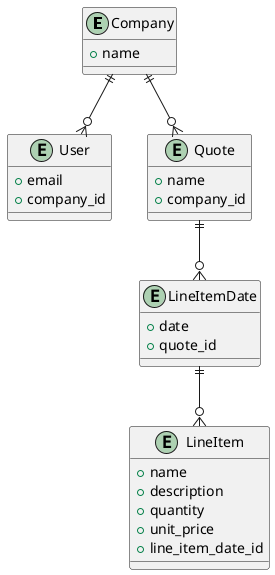

# README

This codebase is source from <a href="https://www.hotrails.dev/turbo-rails">hotrails.dev/turbo-rails</a>  tutorial with some adjustment like using tailwindcss instead of scss. Rspec instead of minitest.

## VSCode extensions
- [Ruby LSP](Shopify.ruby-lsp)
- [solargraph](castwide.solargraph)
- [ruby-rubocop-revived](LoranKloeze.ruby-rubocop-revived)
- [Ruby Around the Block](elliotlarson.ruby-around-the-block)
- [Tailwind CSS Intellisense](bradlc.vscode-tailwindcss)
- [Rails](bung87.rails)
- [endwise](kaiwood.endwise)

## Getting Started

```sh
bin/setup
```

## Development

```sh
bin/dev
```

## System test
1. update chromium version accordingly in `spec/rails_helper.rb`
2. Run `bundle exec rspec`

## ERD


<details>
<summary>PUML</summary>



</details>

<!-- This README would normally document whatever steps are necessary to get the
application up and running.

Things you may want to cover:

* Ruby version

* System dependencies

* Configuration

* Database creation

* Database initialization

* How to run the test suite

* Services (job queues, cache servers, search engines, etc.)

* Deployment instructions

* ... -->
